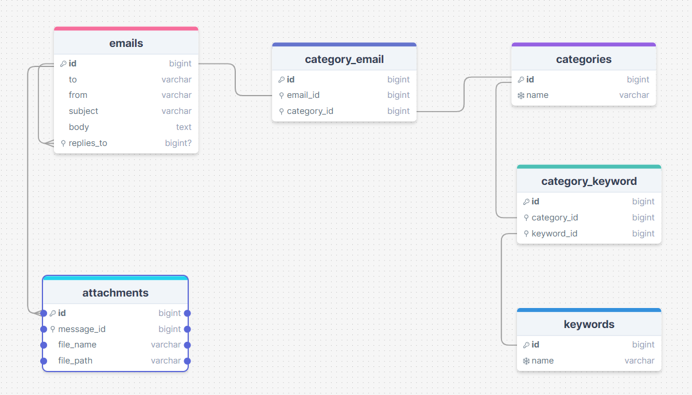

# Laravel Email Application

This is a Laravel application that handles sending, receiving, viewing, and categorizing emails using IMAP and SMTP. The application supports functionalities such as replying, forwarding, and attaching files to emails. 

## Database Design



# Base URL
http://localhost:8080

## Features

- Send and receive emails.
- View emails in the inbox and outbox.
- Categorize emails.
- Reply to and forward emails.
- Handle email attachments.
- Use queues for email sending to improve performance.


4. **Update the `.env` file:**

    ```dotenv
    MAIL_MAILER=log
    MAIL_HOST=127.0.0.1
    MAIL_PORT=2525
    MAIL_USERNAME=null
    MAIL_PASSWORD=null
    MAIL_ENCRYPTION=null
    MAIL_FROM_ADDRESS=your_email@example.com
    MAIL_FROM_NAME="${APP_NAME}"

    IMAP_HOST=imap.your-email-provider.com
    IMAP_PORT=993
    IMAP_ENCRYPTION=ssl
    IMAP_USERNAME=your_email@example.com
    IMAP_PASSWORD=your_email_password
    ```

7. **Seed the database with test data:**

    ```bash
    php artisan db:seed
    ```


## Usage

- Visit `http://localhost:8000` to view the application.
- Use the navigation bar to access the inbox, outbox, and email creation form.
- Categorize emails directly from the inbox.
- Reply to and forward emails from the email detail view.
- Run the fetch command to fetch emails into the inbox based on IMAP:

    ```bash
    php artisan fetch:emails
    ```

## Queue Configuration

To handle email sending via a queue, follow these steps:

1. **Set up the queue driver in `.env`:**

    ```dotenv
    QUEUE_CONNECTION=database
    ```

2. **Run the queue migration:**

    ```bash
    php artisan queue:table
    php artisan migrate
    ```

3. **Start the queue worker:**

    ```bash
    php artisan queue:work
    ```

## TODOS

- Apply the repository pattern with the service class to isolate business logic from the controller.
- Use query builder instead of ORM to optimize database performance.
- Apply queue jobs when sending emails.


